 
### Internet Blocking using firewall rule in pfSense

##### I have 4 client machine on virtual box
##### Clinet1 IP: 10.0.0.11
##### clinet2 IP: 10.0.0.12
##### clinet3 IP: 10.0.0.13
##### client4 IP: 10.0.0.14

##### Accoding to requement block the INTERNET on two client machine(10.0.0.11/10.0.0.12)

##### Accoding to another requement allow the INTERNET on two client machine(10.0.0.13/10.0.0.14)

 ### Here the steps of create the aliases from firewall.
##### 1). Click on firewall tab .
##### 2). Click on aliases buttion.
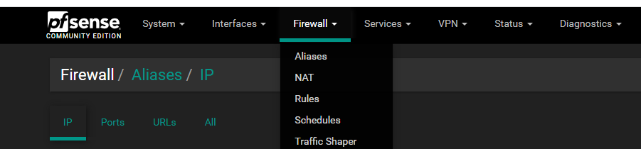
##### 3). Now, click on Add buttoon. 
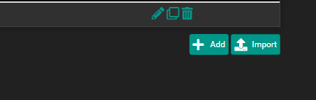

##### 3). Now fill the detail of Clients. 

##### 6). Click on Save button.

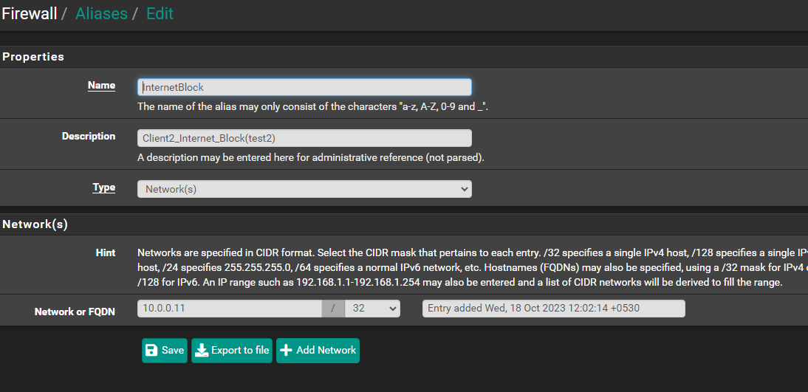

##### As same seteps we can create aliases accoding to reqrements.

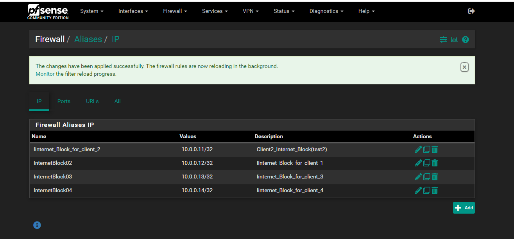

### Here the steps of create the firewall rules for block Inernet.
##### 1). Click on firewall tab .
##### 2). Click on rules buttion.

##### 3). Now, click on Add buttoon. 
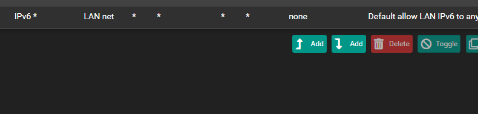

##### 4). Now fill the detail of rules for Clients. 
##### 5). Now, Select the Action "Block". 
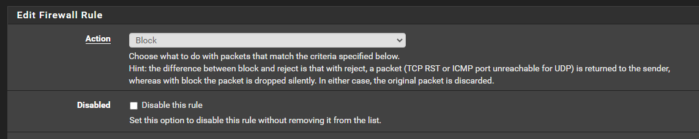
##### 6). Now, Select the aliases in the sourse "Block". 
##### 7). Click on Save button.
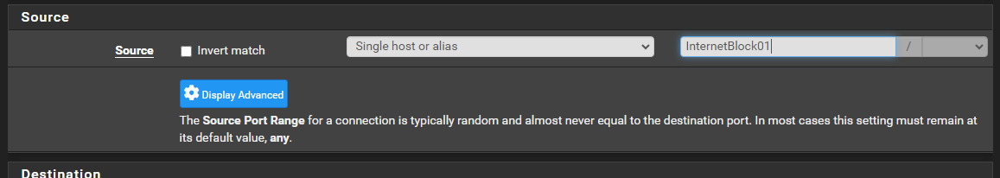

### Here the steps of check the blocked Inernet on client1.
##### 1). Open cliet1 machine(make sure check the Network adapter LAN of pfseance on clint machine). 
##### 2). Open the termial and check the IP address.
##### 3). ping google.com for check the Internet connection.
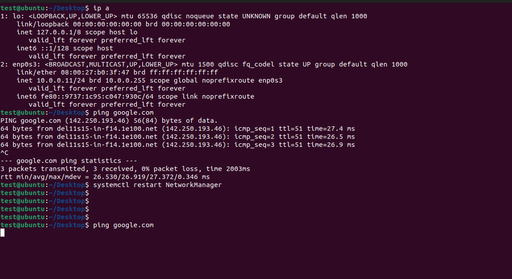

##### Note: As same seteps for clint2 machine blocked.
##### Here the list of rules create for block Internet for clints.

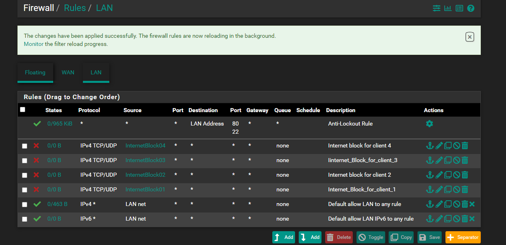

##### Now, Accoding to requement we should the blocked Intenet the client1/client2 IP(10.0.0.11/10.0.0.12)

##### Now, Another requement for allow the Internet for client3/client4 IP(10.0.0.13/10.0.0.14)

### Here the steps for allow the inernet for client3/client4.

##### 1). Go to firewall rules section.
##### 2). Now, Click on Edit (client3/client4)
##### 3). Now, Change the Action "Block to Pass" (client3/client4).
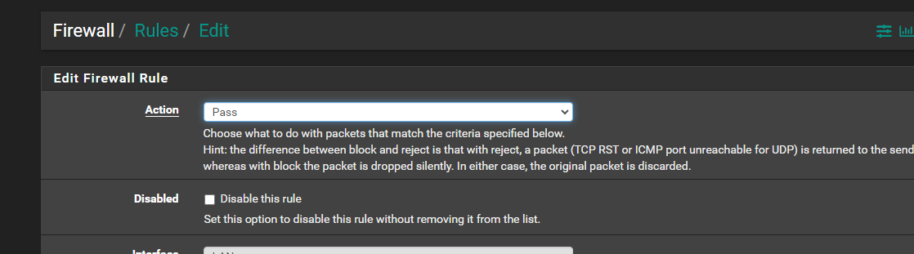
##### 4). Now, Click on Save button.

### Now, chech the Internet allowd on client3/client4.

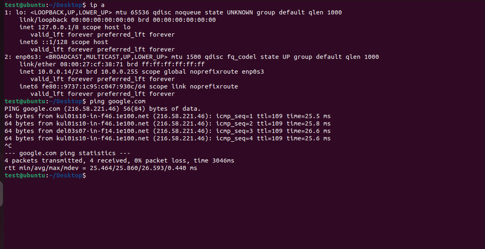

 