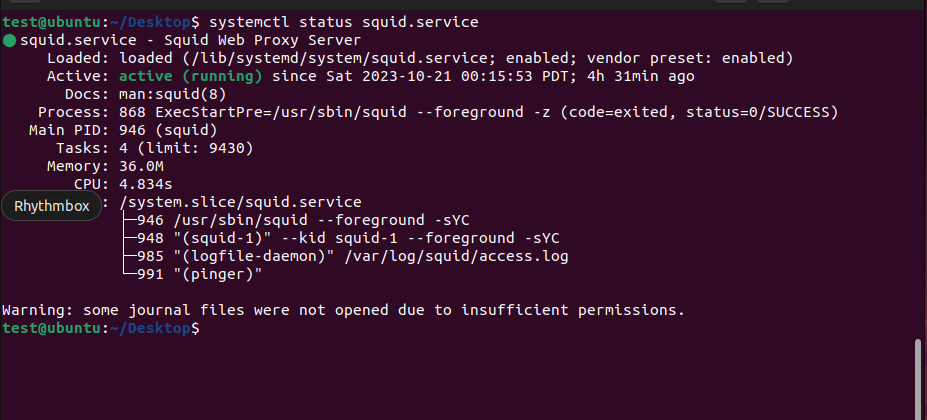

### How to setup squid proxy on ubuntu 22.04.

Here the steps for setup squid proxy.

```
sudo apt update && sudo apt upgrade -y
```

```
 sudo apt-cache policy squid
```

```
sudo apt install -y squid
```

```
sudo systemctl start squid
```

```
sudo systemctl enable squid

```

```
sudo systemctl status squid
```
 


##### Configure Squid proxy.

```
sudo cp /etc/squid/squid.conf  /etc/squid/squid.conf.orig
```

 ```
 sudo vim /etc/squid/squid.conf
 ```

##### 1. Change squid default port.
```
#http_port 3128
http_port 8080
```
##### Make sure to allow the port though the firewall.
```
sudo ufw allow 8080/tcp
sudo ufw enable
```

###### 2. Set Squid cache memory size.

```
cache_mem 256 MB
```

```
dns_nameservers 8.8.8.8 8.8.4.4
```


##### Now, let's create rules for bloked.


##### I have tested blocking a particular website using Squid proxy on Ubuntu 22.04.

###### Clint_1 IP: 10.0.0.14
###### Clint_2 IP: 10.0.0.18
###### Clint_3 IP: 10.0.0.13

##### Client 1's blocked website list:(block.txt)
###### Facebook.com
###### Instagram.com

##### Client 2's blocked website list:(block2.txt)
###### Youtube.com
###### Amozon.com

##### Client 3's blocked website list:(block3.txt)
###### Google.com
###### Twitter.com

##### Note: All the websites allow access only to desired, partially blocked websites on the client's machine.

###### Here are the ACL rules for client-blocked websites.


```
acl test src 10.0.0.14
acl block dstdomain "/etc/squid/block.txt"
http_access deny block test
http_access allow test

acl admin src 10.0.0.18
acl block dstdomain "/etc/squid/block2.txt"
http_access deny block test
http_access allow test

acl clint2 src 10.0.0.13
acl block dstdomain "/etc/squid/block3.txt"
http_access deny block test
http_access allow test

```


##### I have created two rules for blocking internet access on all client machines, and another rule to allow full access for Squid proxy machines on the pfSense firewall.


##### Now, I have created a firewall rule to deny all internet access for clients.


##### Here is the rule to give full access to the entire network of the Squid proxy machine:


#####  Firstly, I granted internet access to the Squid proxy, then I blocked internet access for all clients


#### I have tested the following requirements.

##### 1. Pfsense will allow the internet to Squid proxy machine
 
##### The Squid proxy is set up on this server to allow internet access through the pfSense firewall.


##### Now, Internet access is denied from the pfSense firewall.


#### Now, I have configured the Squid proxy's IP and port to allow internet access in the Firefox browser, and I have blocked a particular website on client IP: 10.0.0.13.


```
Squid proxy IP : 10.0.0.18 
Port: 8080
```


##### Now, let's check the clint IP 10.0.0.13
##### Blocked website list:
##### Google.com
##### Twitter.com


##### Now, twitter blocked.


##### Now, you can access all the other's website(amazon).


